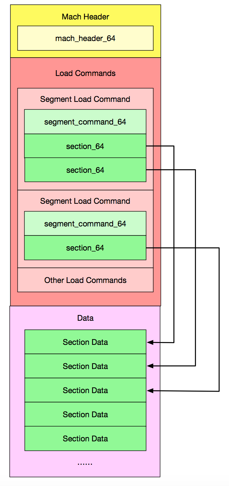

# macOS notes

## general notes

Specification:
- https://github.com/aidansteele/osx-abi-macho-file-format-reference
- http://docs.rs/object
- https://alexdremov.me/mystery-of-mach-o-object-file-builders/
- https://www.youtube.com/watch?v=S9FFzsF0aIA&list=WL&index=1 (nice intro video)

- File format layout:

 

- Section name is limited to 16 characters -> `-ffunction-sections -fdata-sections` are implemented with `MH_SUBSECTIONS_VIA_SYMBOLS` - each symbol can be treaded as a separate section
  for purpose of GC.

- `__compact_unwind` format is used (monolithic) -> simiarly to `.eh_frame` on Linux - must be parsed and GCed

- `__stubs` correspond to PLT - `-Wl,-bind_at_load` has same meaning as `BIND_NOW` -> non-lazy binding is possible

- [`Dysymtab`](https://alexdremov.me/mystery-of-mach-o-object-file-builders/#dysymtab) - info about symbols and where are defined

- No symbol versioning, compatibility for shared libraries used instead:

```
DylibCommand {
    Cmd: LC_LOAD_DYLIB (0xC)
    CmdSize: 0x38
    Dylib {1
        Name: "/usr/lib/libSystem.B.dylib" (0x18)
        Timestamp: 0
        CurrentVersion: 1356.0.0
        CompatibilityVersion: 1.0.0
    }
}
```

- no linker scripts

- no copy relocations

- the ld linker uses a different set of option names - though most of them have a direct mapping in the BFD

- no protected visibility

- two-level binding for externally defined symbols in a shared library:

```
Dynamic symbols

Import { library: "/usr/lib/libSystem.B.dylib", name: "__tlv_bootstrap" }
Import { library: "/usr/lib/libSystem.B.dylib", name: "_printf" }
Import { library: "/usr/lib/libSystem.B.dylib", name: "dyld_stub_binder" }
```

- clang -static -> unsupported

- `-fPIC` and `-fno-PIC` are supported
- `-fno-pie` - unsupported (security reasons) and ignored option

- TLS supported with:

```
6: Section { segment: "__DATA", name: "__thread_vars", address: 100008000, size: 18, align: 8, kind: TlsVariables, flags: MachO { flags: 13 } }
7: Section { segment: "__DATA", name: "__thread_bss", address: 100008018, size: 4, align: 4, kind: UninitializedTls, flags: MachO { flags: 12 } }
...
0: Symbol { name: "_i$tlv$init", address: 100008018, size: 0, kind: Tls, section: Section(SectionIndex(7)), scope: Compilation, weak: false, flags: MachO { n_desc: 0 } }
2: Symbol { name: "_i", address: 100008000, size: 0, kind: Tls, section: Section(SectionIndex(6)), scope: Dynamic, weak: false, flags: MachO { n_desc: 0 } }
4: Symbol { name: "__tlv_bootstrap", address: 0, size: 0, kind: Unknown, section: Undefined, scope: Unknown, weak: false, flags: MachO { n_desc: 100 } }
...
```

- generally speaking the mach-O format is pretty close to the ELF container

## benchmarks: LLD vs. system linker

Runnning on MacMini M4:

### duckDB:

```
ld:
  Time (mean ± σ):      1.144 s ±  0.124 s    [User: 3.190 s, System: 0.426 s]
lld:
  Time (mean ± σ):      1.630 s ±  0.072 s    [User: 2.010 s, System: 0.271 s]

bloaty ../../duckdb
    FILE SIZE        VM SIZE
 --------------  --------------
  48.8%   205Mi  48.8%   205Mi    __TEXT,__text
  16.1%  68.0Mi  16.1%  68.0Mi    __DATA,__data
  10.6%  44.7Mi  10.6%  44.7Mi    String Table
   7.9%  33.2Mi   7.9%  33.2Mi    __TEXT,__const
   4.8%  20.1Mi   4.8%  20.1Mi    Symbol Table
   3.6%  15.3Mi   3.6%  15.3Mi    __TEXT,__eh_frame
   3.6%  15.1Mi   3.6%  15.1Mi    [__LINKEDIT]
   0.9%  3.76Mi   0.9%  3.76Mi    __TEXT,__gcc_except_tab
   0.8%  3.27Mi   0.8%  3.27Mi    Code Signature
   0.6%  2.74Mi   0.6%  2.74Mi    __TEXT,__unwind_info
   0.6%  2.65Mi   0.6%  2.65Mi    __TEXT,__cstring
   0.4%  1.83Mi   0.4%  1.83Mi    __DATA,__asan_globals
   0.4%  1.71Mi   0.4%  1.71Mi    __TEXT,__asan_cstring
   0.2%   778Ki   0.2%   778Ki    __TEXT,__stubs
   0.1%   583Ki   0.1%   583Ki    __DATA_CONST,__const
   0.1%   534Ki   0.1%   534Ki    __DATA_CONST,__got
   0.1%   526Ki   0.1%   526Ki    Indirect Symbol Table
   0.1%   502Ki   0.1%   502Ki    Function Start Addresses
   0.1%   468Ki   0.1%   468Ki    __DATA,__asan_liveness
   0.0%  51.2Ki   0.0%  51.1Ki    [10 Others]
   0.0%       0   0.0%  16.1Ki    __DATA,__bss
 100.0%   421Mi 100.0%   421Mi    TOTAL
```

### clang:

```
ld:
  Time (mean ± σ):     301.8 ms ±   3.7 ms    [User: 1201.5 ms, System: 276.9 ms]
lld:
  Time (mean ± σ):     591.1 ms ±  26.1 ms    [User: 680.7 ms, System: 113.0 ms]

bloaty ../../../../bin/clang-23
    FILE SIZE        VM SIZE
 --------------  --------------
  45.2%  80.8Mi  45.0%  80.8Mi    __TEXT,__text
  28.3%  50.7Mi  28.2%  50.7Mi    __TEXT,__const
  13.5%  24.2Mi  13.5%  24.2Mi    String Table
   5.8%  10.3Mi   5.7%  10.3Mi    Symbol Table
   2.5%  4.56Mi   2.5%  4.56Mi    [__LINKEDIT]
   2.1%  3.72Mi   2.1%  3.72Mi    __DATA_CONST,__const
   1.3%  2.40Mi   1.3%  2.40Mi    __TEXT,__cstring
   0.8%  1.39Mi   0.8%  1.39Mi    Code Signature
   0.0%       0   0.3%   633Ki    __DATA,__bss
   0.3%   469Ki   0.3%   469Ki    __TEXT,__unwind_info
   0.2%   307Ki   0.2%   307Ki    Function Start Addresses
   0.0%  58.6Ki   0.0%  58.6Ki    __DATA,__data
   0.0%  41.2Ki   0.0%  41.2Ki    __TEXT,__literals
   0.0%       0   0.0%  39.8Ki    __DATA,__common
   0.0%  13.1Ki   0.0%  13.1Ki    __TEXT,__stubs
   0.0%  11.3Ki   0.0%  11.3Ki    __DATA_CONST,__got
   0.0%  10.0Ki   0.0%  10.0Ki    Indirect Symbol Table
   0.0%  7.84Ki   0.0%  7.79Ki    [8 Others]
   0.0%  5.43Ki   0.0%  5.53Ki    [__TEXT]
   0.0%  5.21Ki   0.0%  3.86Ki    [__DATA]
   0.0%  2.84Ki   0.0%  2.84Ki    [__DATA_CONST]
 100.0%   178Mi 100.0%   179Mi    TOTAL
```
